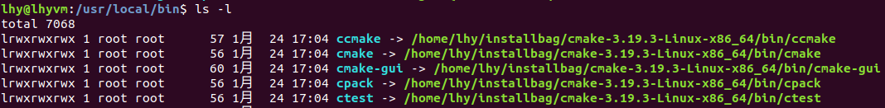

**查看系统版本**

```shell
cat /proc/version
#Linux version 3.16.0-30-generic (buildd@kissel)   linux内核版本号
#gcc version 4.8.2              gcc编译器版本号
#Ubuntu 4.8.2-19ubuntu1         Ubuntu版本号

uname -a
#显示linux的内核版本和系统是多少位的：X86_64代表系统是64位的。

lsb_release -a
#Distributor ID: Ubuntu    //类别是ubuntu
#Description:    Ubuntu 14.04.2 LTS  //14年2月4月发布的稳定版本，LTS是Long Term Support：长时间支持版本  三年 ，一般是18个月
#Release:    14.04  //发行日期或者是发行版本号
#Codename:   trusty //ubuntu的代号名称
```


更换系统镜像源

```
打开 Software & Updates -> Ubuntu Software,其界面有个 Download from 项
```


#### **安装VMvare Tools**

```
1.关闭虚拟机；
2.在虚拟机设置分别设置CD/DVD、CD/DVD2和软盘为自动检测三个步骤；
3.再重启虚拟机，灰色字即点亮。
4.点击虚拟机->重新安装VMware Tools
5.在桌面上找到安装包，tar -zxvf解压，执行.pl结尾的文件
```


#### **aptitude**

aptitude与 apt-get 一样，是 Debian 及其衍生系统中功能极其强大的包管理工具。与 apt-get 不同的是，aptitude在处理依赖问题上更佳一些。举例来说，aptitude在删除一个包时，会同时删除本身所依赖的包。这样，系统中不会残留无用的包，整个系统更为干净。

```
~$ sudo apt-get install aptitude
~$ su -
~# aptitude install gcc

```


#### **ubuntu下调整字体**

```
放大： ’Ctrl’ + ’shift ’ + ‘ + ’
缩小： ’Ctrl’ + ‘ - ’
```


#### **vim配置**

```
vim的配置文件的地址： ~/.vimrc

set number			:行号
set tapstop=4		：tap缩进
syntax on			：语法高亮
```


#### **安装clion**

```
tar -zxvf *.tar.gz	解压文件
运行bin下面的clion.sh脚本
记得勾选生成桌面快捷方式
```


#### **开启ubuntu下的FTP服务**

```shell
#如果获取不到文件，可以更新一下下载源
sudo apt-get install vsftpd		:安装FTP服务
sudo vi /etc/vsftpd.conf		:安装完成后修改配置
{
	local_enable=YES
	write_enable=YES
}
sudo /etc/init.d/vsftpd restart	:重启FTP服务
```


#### **安装sqlite**

```shell
tar xvzf sqlite-autoconf-3071502.tar.gz
cd sqlite-autoconf-3071502
./configure --prefix=/usr/local
make
make install
```


#### **安装libcurl**

```shell
./configure
make
make install
```

安装openssl

```shell
apt-get install libssl-dev
#安装openssl的编译依赖
```


#### **安装postman**

```shell
#解压文件
sudo tar -zxvf file
#进入文件内，执行程序（好像必须要先执行，然后才能创建图标）
cd Postman; ./Postman
#将可执行文件添加到环境变量搜索的文件夹内
sudo ln -s ~/installbag/Postman/Postman /usr/bin
#添加启动器应用图标（创建图标的文件）
sudo vim /usr/share/applications/postman.desktop
#向以上打开的文件内写入如下内容
{
[Desktop Entry]

Encoding=UTF-8

Name=Postman

Exec=postman

Icon=/home/zzh/下载/Postman/resources/app/assets/icon.png

Terminal=false

Type=Application

Categories=Development;

}
```


**重启网络连接**

```shell
sudo service network-manager stop
sudo rm /var/lib/NetworkManager/NetworkManager.state
sudo service network-manager start
 
sudo gedit /etc/NetworkManager/nm-system-settings.conf
false----改成--->true
 
sudo service network-manager restart
```


**同步网络时间**

```shell
#安装ntpdate工具
sudo apt-get install ntpdate
#将系统时间和网咯同步
ntpdate cn.pool.ntp.org
将时间写入硬件
hwclock --systohc
```


**cmake安装**

```
下载Binary distributions:	https://cmake.org/download/
解压：tar zxvf cmake-3.12.2-Linux-x86_64.tar.gz
创建软链接：ln -sf /opt/cmake-3.12.2/bin/*  /usr/local/bin/
检查版本：cmake --version
```




### adb使用

```shell
#更改android目录文件权限
1. su mount -o remount,rw /system
2. chmod -R 777 /system
3. adb remount

#常用操作方法
adb root
adb remount
adb shell  #进入开发板目录树
adb push ./dir /system/lib  #拷贝dir目录下的所有文件到/system/lib目录下
cd 
```


